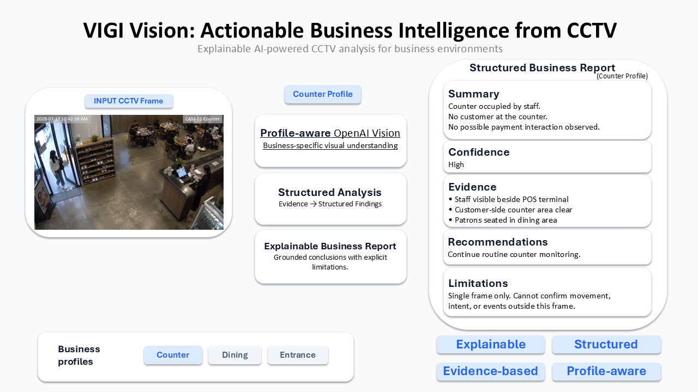
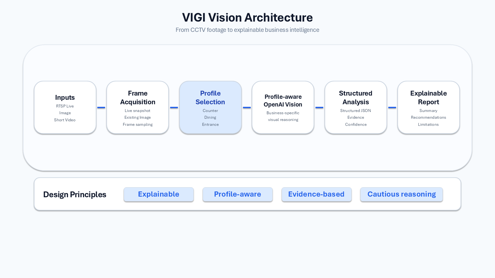
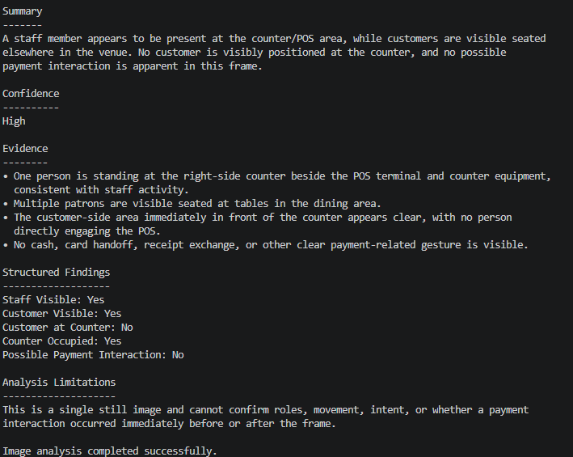

# VIGI Vision

**Turn CCTV footage into explainable business intelligence.**

<p align="center">
  
</p>

VIGI Vision is an AI-powered business video analysis system that transforms CCTV images and short videos into structured, explainable business reports.

It can inspect a live RTSP source, analyze a previously captured image, analyze a short local video, retrieve and analyze a bounded NVR recording, or collect a configured multi-camera investigation package using profile-aware analysis designed for different business environments.

Rather than describe every visible object in a scene, VIGI Vision applies a selected business profile to focus its analysis on the operational questions relevant to that location. Its reports separate observable evidence, estimates, possible events, recommendations, and limitations.

The project is intentionally cautious: it is designed to support human review of camera observations, not to make identity, payment, causality, or continuous-tracking claims.

## Why VIGI Vision?

Business camera footage is abundant, but extracting useful operational insights often requires manual review.

Generic image captioning describes what is visible.

VIGI Vision instead analyzes each scene using a business profile, producing structured reports focused on the operational questions that matter in that environment.

VIGI Vision uses profile-aware prompts and strict structured schemas to produce a report tailored to the selected context. This makes the output easier to review and act on while keeping the distinction between what is visible, what is estimated, and what remains unknown explicit.

## Key Features

- **Live RTSP inspection** captures one current frame from a configured VIGI NVR or standalone IPC source for analysis.
- **Image analysis** evaluates a previously captured camera frame without connecting to a live camera.
- **Short-video temporal analysis** samples 2–10 evenly spaced frames from a local MP4 of 30 seconds or less in one OpenAI request.
- **NVR recording analysis** retrieves one bounded replay clip through the public SDK, analyzes it through the same temporal workflow, then removes the temporary MP4.
- **Multi-camera investigation** collects the current restaurant-checkout deployment into a durable, credential-free artifact package with replay clips, anchor snapshots, and a manifest.
- **Profile-aware business analysis** uses a dedicated prompt and strict schema for each supported business context.
- **Explainable reports** distinguish observable evidence, estimates, possible events, recommendations, unknowns, and limitations.
- **Structured JSON output** keeps the analysis result as the source of truth.

## Project Architecture

<p align="center">
  
</p>

<p align="center">
<i>
The pipeline transforms CCTV footage into structured, explainable business reports through profile-aware analysis.
</i>
</p>

## Business Profiles

### Counter

Reviews counter activity and reports only a possible payment interaction. It never concludes that a payment occurred from a single frame.

### Dining

Reviews a dining area, including estimated counts and profile-specific observations from the available image or sampled frames.

### Entrance

Reviews an entrance area, including estimated counts and profile-specific observations from the available image or sampled frames.

For image analysis, choose exactly one canonical profile ID: `counter`, `dining`, or `entrance`. Korean CLI aliases resolve to the same IDs: `카운터` for `counter`, `홀` or `식사공간` for `dining`, and `입구` or `신발장` for `entrance`. Structured output always uses the canonical English profile ID.

## Example Workflow

1. Choose the business profile that matches the camera location.
2. Inspect one current live frame, or provide a local image or short video.
3. VIGI Vision analyzes the available visual evidence with that profile's prompt and structured schema.
4. Review the report's evidence, estimates, possible events, recommendations, unknowns, and limitations.
5. Use the report as an input to human operational review, not as a definitive record of identity, transaction, cause, or continuous activity.

## Example Output

The following report was generated from the public `sample_data/counter_ai.jpg` image using the `counter` profile.

<p align="center">
  
</p>

<p align="center">
<i>
The report separates visible evidence and structured findings from conclusions the sampled frame cannot support.
</i>
</p>

## CLI Examples

Analyze an existing camera frame for a counter demonstration:

```text
uv run vigi-vision analyze-image sample_data/counter_ai.jpg --profile counter
```

Inspect a configured live camera source and analyze one current frame:

```text
uv run vigi-vision inspect
```

Analyze a short local clip with temporal samples:

```text
uv run vigi-vision analyze-video private_data/clip.mp4 --profile dining
```

Analyze a bounded NVR recording (the start time is UTC):

```text
uv run vigi-vision analyze-recording --channel 1 --start "2026-07-20 12:00:00" --duration 30s --profile counter
```

Capture one current NVR channel frame without OpenAI analysis:

```text
uv run --active vigi-vision snapshot --channel 1
```

Collect the current restaurant-checkout investigation package (the supplied time is Asia/Seoul):

```text
uv run --active vigi-vision investigate --scenario restaurant-checkout --time "2026-07-20 12:34:18"
```

## Installation

Install the project with `uv sync`, copy `.env.example` to `.env`, and set:

- `OPENAI_API_KEY` for analysis commands (the `snapshot` command does not require it)
- `VIGI_SOURCE=nvr` with `VIGI_HOST`, `VIGI_USERNAME`, and `VIGI_PASSWORD`; or
- `VIGI_SOURCE=ipc` with `VIGI_IPC_HOST`, `VIGI_IPC_USERNAME`, and `VIGI_IPC_PASSWORD`
- optionally `VIGI_PORT`, `VIGI_VERIFY_SSL`, `VIGI_CHANNEL_ID`, `VIGI_STREAM`, and `FFMPEG_PATH`

VIGI Vision explicitly loads `.env` from the current working directory. OS environment variables override matching `.env` values when needed.

`ffmpeg` must be available on `PATH` unless `FFMPEG_PATH` names its executable. The selected NVR or IPC credentials are supplied separately to ffmpeg for its RTSP Digest challenge; they are not embedded in the SDK-built URL. Standard IPC RTSP uses the SDK-generated default-port URL; Vision does not support `VIGI_IPC_PORT`. `VIGI_IPC_VERIFY_TLS` is an SDK/OpenAPI control-plane setting and is not read by this RTSP-only Vision path.

### Detailed CLI Notes

For NVR, list safe channel metadata first to choose `VIGI_CHANNEL_ID` when needed. This command is deliberately NVR-only:

```text
uv run vigi-vision channels
```

`snapshot` is NVR-only, verifies that the requested channel is online, and saves a persistent JPEG under `artifacts/channel-snapshots/` using a channel-and-UTC-timestamp filename. It reuses the same SDK live-URL and ffmpeg one-frame capture boundary as `inspect`, and never invokes OpenAI.

```text
uv run --active vigi-vision snapshot --channel 1
```

`investigate` is NVR-only and currently supports the fixed `restaurant-checkout` deployment: channel 1 is counter, channel 2 is entrance, and channel 3 is dining. It parses `--time` as `Asia/Seoul`, invokes the shared investigation service, and prints the resulting package path under `artifacts/investigations/`. Collection failures remain visible as a warning while successfully collected artifacts and the manifest are retained. The command requires no OpenAI API key and never prints replay URLs, credentials, hosts, temporary paths, or ffmpeg arguments.

```text
uv run --active vigi-vision investigate --scenario restaurant-checkout --time "2026-07-20 12:34:18"
```

For a standalone IPC, set `VIGI_SOURCE=ipc`; `inspect` uses the public IPC RTSP builder and does not perform IPC OpenAPI authentication. A live inspection completes only when source validation, one-frame extraction, and OpenAI structured image analysis all succeed.

Image analysis does not invoke ffmpeg and does not connect to a live camera:

```text
uv run vigi-vision analyze-image sample_data/counter_ai.jpg --profile counter
uv run vigi-vision analyze-image sample_data/dining.jpg --profile dining
uv run vigi-vision analyze-image sample_data/entrance.jpg --profile entrance
```

Short-video analysis accepts one local MP4 of 30 seconds or less. It sends 2–10 evenly spaced representative frames in exactly one OpenAI request, then removes its temporary extracted JPEGs when the command finishes. It does not connect to a camera, record video, or retain the local clip.

```text
uv run vigi-vision analyze-video private_data/clip.mp4 --profile counter
uv run vigi-vision analyze-video private_data/clip.mp4 --profile dining
uv run vigi-vision analyze-video private_data/clip.mp4 --profile entrance
```

NVR recording analysis is available only with `VIGI_SOURCE=nvr`. It searches the configured NVR for a recording overlapping the requested UTC window, extracts one temporary MP4, and runs the same bounded local-video analysis and report renderer shown above. `--duration` accepts a positive whole-second value such as `30s`. The replay MP4 is removed whether analysis succeeds or fails; temporary frame cleanup remains the local-video workflow's responsibility. Authentication failures, unavailable recordings, replay extraction failures, video-analysis failures, and OpenAI failures are reported as separate user-facing errors.

```text
uv run vigi-vision analyze-recording --channel 1 --start "2026-07-20 12:00:00" --duration 30s --profile counter
```

## Safety & Limitations

VIGI Vision is deliberately bounded by the evidence in an image or sparse video samples. It does **not** support identity tracking, face recognition, payment confirmation, causal claims, or continuous tracking.

For a single frame, counter reports describe only a possible payment interaction, never a definite payment conclusion. Dining and entrance counts are estimates. For short video, sparse samples do not support identity tracking, continuous activity claims, causal payment or transaction conclusions, or claims about unsampled intervals. Recommendations are tied to visible evidence or an explicit sampling limitation.

Do not log or persist the RTSP URL, credentials, replay URL, extracted frame, or temporary replay MP4 outside `artifacts/`. `sample_data/` contains public demonstration images for profile-based examples. `private_data/` is reserved for local real-camera captures and is ignored by Git; never commit production, customer, employee, surveillance footage, extracted frames, replay clips, or report data that identifies people.


## Roadmap

- Add natural-language event search and clip discovery on top of the current analysis pipeline.
- Expand evaluation with representative, privacy-safe demonstration scenarios.
- Refine profile prompts and structured report schemas using human review feedback.

## Project Resources

Read the [project charter](PROJECT.md) for project context. Contributors and coding agents should read [AGENTS.md](AGENTS.md); deeper documentation is routed from [docs/README.md](docs/README.md).
